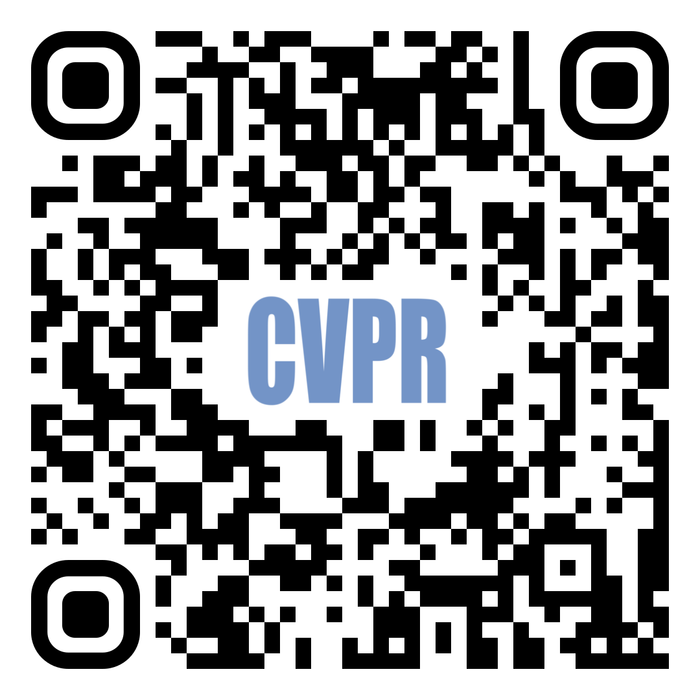

# VolRAFT: Volumetric Optical Flow Network for Digital Volume Correlation of Synchrotron Radiation-based Micro-CT Images of Bone-Implant Interfaces

## What is VolRAFT?

In materials science research, digital volume correlation (DVC) analysis is commonly used to track deformations and strains to elucidate morphology-function relationships. Optical flow-based DVC is particularly popular because of its robustness to estimate the correlation as a dense deformation vector. Recently, computer vision researchers showed that network-based optical flow approaches can outperform classical iterative optical flow approaches. In this paper, we propose a supervised machine learning approach for digital volume correlation, VolRAFT, that estimates the 3D displacement vector between the reference volume and the deformed volume. The proposed approach extends the state-of-the-art network-based optical flow method, RAFT, from 2D images to 3D volumes such that it predicts the volumetric displacement vector from the input volume pairs. Experiments show that the proposed network performs well in estimating different displacement fields when compared to cutting-edge iterative DVC methods for bone-implant materials based on high resolution synchrotron-radiation micro-computed tomography imaging data.

Abstract from Wong, T.M., Moosmann, J. & Zeller-Plumhoff, B. (2024). VolRAFT: Volumetric Optical Flow Network for Digital Volume Correlation of Synchrotron Radiation-based Micro-CT Images of Bone-Implant Interfaces. In Proceedings of the IEEE/CVF Conference on Computer Vision and Pattern Recognition Workshops. (Accepted for oral presentation)


## How to Cite
If you use this code in your scientific publication, please cite the paper

   **VolRAFT: Volumetric Optical Flow Network for Digital Volume Correlation of Synchrotron Radiation-based Micro-CT Images of Bone-Implant Interfaces**<br/>
     *Tak Ming Wong, Julian Moosmann, Berit Zeller-Plumhoff*<br/>
     Accepted for oral presentations by IEEE/CVF Conference on Computer Vision and Pattern Recognition (CVPR) Workshops, 2024
     
     @InProceedings{wong2024volraft,
        author    = {Wong, Tak Ming and Moosmann, Julian and Zeller-Plumhoff, Berit},
        title     = {VolRAFT: Volumetric Optical Flow Network for Digital Volume Correlation of Synchrotron Radiation-based Micro-CT Images of Bone-Implant Interfaces},
        booktitle = {Proceedings of the IEEE/CVF Conference on Computer Vision and Pattern Recognition (CVPR) Workshops},
        month     = {},
        year      = {2024},
        pages     = {}
    }

## How to download?

<table border="0">
  <tr border="0">
    <td align="center" border="0"> 
      <a href="https://github.com/tak-wong/VolRAFT" target="_blank">
        
      </a> <br/>
      The GitHub repository
    </td>
    <td align="center" border="0">
      <a href="https://sites.google.com/view/cv4ms-cvpr-2024/home" target="_blank">
        
      </a> <br/>
      The paper will be available at CVPR Workshops - CV4MS
    </td>
  </tr>
</table>

Datasets:
- Bone-implant materials: please contact us to access the datasets as it is too large for hosting on public-available platforms.

## Library packages for reference

| Library | version | Description |
| --- | --- | --- |
| `pytorch` | 2.1.0 | with CUDA |
| `numpy` | 1.26.0 | |
| `matplotlib` | 3.8.1 | |
| `scipy` | 1.11.3 | |
| `PIL` | 10.1.0 | |
| `tqdm` | 4.66.1 | |
| `pyyaml` | 6.0.1 | |

Create a conda environment by this `mamba` command (or probably by `conda`):

```
mamba create -n volraft pytorch==2.1.0 torchvision==0.16.0 torchaudio==2.1.0 pytorch-cuda=11.8 numpy=1.26.0 matplotlib=3.8.1 scipy=1.11.3 pillow=10.1.0 tqdm=4.66.1 pyyaml=6.0.1 -c pytorch -c nvidia -c conda-forge
```
    

Full conda environment can be found in [`environment.yaml`](environment.yaml)

## File structure

[`checkpoints`](checkpoints) contains the checkpoint file and its corresponding YAML configuration file.

[`datasets`](datasets) contains:
- [`dataset.py`](datasets/dataset.py) is the dataset class.
- [`combine_yaml.py`](datasets/combine_yaml.py) and [`split_datasets_yaml.py`](datasets/split_datasets_yaml.py) are Python function files to combine and split all YAML files.
- [`datasets.yaml`](datasets/datasets.yaml) contains the dataset YAML file for training and testing.

[`models`](models) contains:
- all Python classes related to models and netowkrs
- [`config`](models/config) contains all configurations (hyperparmeters) of models in YAML format.
- [`VolRAFT`](models/VolRAFT) contains Python scripts of the VolRAFT class extended from the [`RAFT`](https://github.com/princeton-vl/RAFT) repository.

[`scripts`](scripts) contains:
- [`prepare_data.sh`](scripts/prepare_data.sh) is the reference shell script to prepare datasets by loading measurements and flows from YAML lists to numpy files.
- [`train.sh`](scripts/train.sh) is the reference shell script to train the model.
- [`infer.sh`](scripts/infer.sh) is the reference shell script to run inference.
- [`analysis.sh`](scripts/analysis.sh) is the reference shell script to analyze the inference result in comparison to other methods.

[`utils`](utils) contains all Python classes for all utilities and structure classes.

[`prepare_data.py`](prepare_data.py) is the Python script to prepare datasets by loading measurements and flows from YAML lists to numpy files.

[`train.py`](train.py) is the Python script to train the model.

[`infer.py`](scripts/infer.py) is the Python script to run inference based on the provided [`checkpoints`](checkpoints) or the trained checkpoints stored in `results` directory.

[`analysis.py`](analysis.py) is the Python script to analyze the inference result in comparison to other methods based on the slices indicated in [`analysis.yaml`](analysis.yaml).

`results` will store all information and logging files <u>**after**</u> running these scripts.

The Python style guide is [PEP 8](https://peps.python.org/pep-0008/).

## Getting started

There are 2 symbolic links that needs to be prepared:
- `volraft_measurements` link to the folder that contains all measurement volumes.
- `volraft_datasets` link to the folder that will store all of the generated synthetic datasets for training and testing.

Please run these commands to create the symbolic links:

```
ln -s <path/to/measurements> ~/volraft_source/volraft_measurements
ln -s <path/to/datasets> ~/volraft_source/volraft_datasets
```

### How to prepare synthetic datasets for training?

Run the data preparation script by `sh scripts/prepare_data.sh`.<br/>
Refer to [`prepare_data.sh`](scripts/prepare_data.sh)

### How to train the model?

Now, you can run the training script by `sh scripts/train.sh`.<br/>
Refer to [`train.sh`](scripts/train.sh)

### How to run inference?

Train the network and get the full path of training checkpoints in `results` directory.<br/>
Then, put the full-path to the training checkpoints in `results` directory:
```
# folder path to checkpoint
CHECKPOINT_PATH="./checkpoints/volraft_config_120/checkpoint_20240119_184617_980292"
```

Now, you can run the inference script by `sh scripts/infer.sh`.<br/>
Refer to [`infer.sh`](scripts/infer.sh)

### How to analyze result?

Run [`MBS-Opt-flow`](https://github.com/brunsst/MBS-3D-OptFlow)
- Please compile [`MBS-Opt-flow`](https://github.com/brunsst/MBS-3D-OptFlow).
- Navigate to the dataset folder that you want to run (e.g. `cd volraft_datasets/volume_960x1280x1280/2021_11008741_syn0154_103L_Mg5Gd_4w_000_fs004`).
- Run the script [`run_mbsoptflow`](scripts/run_mbsoptflow.sh) for the MBS-Optflow vanilla setting (<u>**Caution**</u>: need to create a symbolic link `~/mbsoptflow` to locate the build folder).
- Run the script [`run_mbsoptflow_opt18`](scripts/run_mbsoptflow_opt18.sh) for the MBS-Optflow optimal setting (<u>**Caution**</u>: need to create a symbolic link `~/mbsoptflow` to locate the build folder).

Run inference and get the full path of inference result in `results` directory.<br/>
Then, put the full-path to the analysis script [`analysis.sh`](scripts/analysis.sh):
```
# folder path to result of inference
RESULT_PATH="<path/to/infer/result>" # TODO: change to your own path
```

Now, you can run the analysis script by `sh scripts/analysis.sh`.<br/>
Refer to [`analysis.sh`](scripts/analysis.sh)

## Contributions

We welcome contributions from everyone who is willing to improve this project. Here's how you can contribute:

### Reporting Bugs

If you find a bug in the code or a mistake in the documentation, you can help us by submitting an issue to the GitHub Repository. With your report, please include:

- Your operating system and version
- The version of the project you're using
- A detailed description of the bug or error
- Steps to reproduce the bug

### Applying to different imaging modalities/datasets/samples

If you want to apply VolRAFT to other imaging modalities/datasets/samples, you can contact us or can submit an issue to the GitHub Repository.

## Acknolwedgements

### Open source project
We specially thank for the contributions of open source projects:
- [`MBS-Opt-flow`](https://github.com/brunsst/MBS-3D-OptFlow): MBS 3D Optical Flow.
- [`RAFT`](https://github.com/princeton-vl/RAFT): Recurrent All Pairs Field Transforms for Optical Flow.

### Contributors
We thank Dr. Stefan Bruns for his valuable insight and the fruitful discussions regarding the optimization of the [`MBS-Opt-flow`](https://github.com/brunsst/MBS-3D-OptFlow) framework.

### Sponsors and Funding
- We acknowledge the Deutsches Elektronen-Synchrotron DESY (Hamburg, Germany), a member of the Helmholtz Association HGF, for the provision of beamtime, related to the proposal 20180109 at the imaging beamline (IBL) P05 at PETRA III at DESY. 
- We acknowledge the ErUM-Data Verbundprojekt 'KI4D4E: Ein KI-basiertes Framework für die Visualisierung und Auswertung der massiven Datenmengen der 4D-Tomographie für Endanwender von Beamlines' which is funded by the Bundesministeriums für Bildung und Forschung (BMBF) (Förderkennzeichen 05D23CG1).

### Special Thanks
This research was supported in part through the Maxwell computational resources operated at DESY.

## License

This project is licensed under the MIT License - see the [LICENSE](LICENSE) file for details.